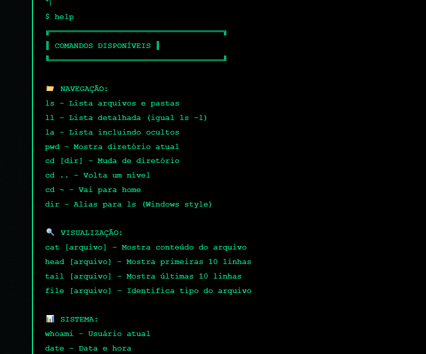

# 🕵️ Não Desista Dev

<div align="center">
    

```
[]()
[]()
[]()
[]()
[]()

<h3>Plataforma de Investigação Digital</h3>
<p>Aprenda sobre esteganografia, criptografia e forense digital de forma prática e envolvente.</p>

[](https://naodesista.dev) 🚧 Em breve
[](https://discord.gg/naodesistadev) 🚧 Em breve
[](https://github.com/nao-desista-dev)
```

</div>

---

## ⚠️ AVISO DE SEGURANÇA

<div align="center">
    <strong>🔴 PROTEJA-SE SEMPRE 🔴</strong>
</div>

Antes de acessar qualquer link:

1. Copie o link
2. Acesse https://virustotal.com
3. Cole o link
4. Analise com múltiplos mecanismos de segurança
5. Só prossiga se for seguro

> "Na investigação digital, a primeira regra é proteger-se. Um bom agente nunca confia cegamente."

---

## 📋 Sobre o Projeto

O **Não Desista Dev** é uma plataforma educacional com desafios progressivos de investigação digital.

### 🎯 Objetivos

* Esteganografia
* Criptografia
* Forense digital
* Comandos Linux
* Raciocínio lógico

---

## 🚀 Começando

### Pré-requisitos

* Navegador moderno
* Noções básicas de terminal (opcional)
* Curiosidade e persistência
* Consciência de segurança digital

---

## 💻 Instalação

```bash
git clone https://github.com/nao-desista-dev/nao-desista-dev.git
cd nao-desista-dev

# opcional
npx live-server
```

---

## 📊 Estatísticas

```
Arquivos:      +500
Páginas:       150+
Puzzles:       50
Ferramentas:   24
Documentos:    15+
Agentes:       1.337
Flags:         3.891
```

---

## 🧩 Estrutura de Níveis

| Nível            | Puzzles | Descrição           |
| ---------------- | ------- | ------------------- |
| 🟢 Iniciante     | 01–10   | Conceitos básicos   |
| 🟡 Intermediário | 11–20   | Técnicas combinadas |
| 🟠 Avançado      | 21–30   | Esteganografia      |
| 🔴 Especialista  | 31–40   | Vulnerabilidades    |
| 🟣 Mestre        | 41–50   | Desafios complexos  |

---

## 🛠️ Ferramentas

| Categoria  | Ferramentas         |
| ---------- | ------------------- |
| 🔊 Áudio   | Audacity, Spek      |
| 🔍 Forense | Autopsy, Volatility |
| 🔐 Cripto  | OpenSSL, Hashcat    |
| 🖼️ Estego | Steghide, ExifTool  |
| 🌐 Rede    | Wireshark, Nmap     |
| 🌍 Web     | Burp Suite, SQLMap  |
| ⚙️ RE      | Ghidra, radare2     |

⚠️ Use todas as ferramentas apenas em ambientes autorizados.

---

## 📚 Documentação

* Como começar
* Guia rápido
* Comandos Linux
* Glossário
* Tutoriais

---

## 🔬 Laboratório

```
generate-ctf
```

> "Alguns desafios não existem ainda."

---

## 📊 Estatísticas em tempo real

stats.html

---

## 📡 API

```
curl https://api.naodesista.dev/v1/puzzles
```

---

## 🤝 Contribuição

Você pode ajudar com:

* Bugs
* Ideias
* Código
* Tradução

---

## 📱 Contato

* Discord: 🚧 Em breve
* GitHub: https://github.com/nao-desista-dev
* Email: [caverna.bh@gmail.com](mailto:caverna.bh@gmail.com)

---

## 📜 Licença

MIT

---

<div align="center">
    <p>Feito com ❤️ por Caverna</p>
    <p>Não Desista Dev</p>

```
<p><strong>Em memória do Celeron D LGA775</strong></p>

<p><em>Nunca desistiu. Nunca nos deixou desistir.</em></p>
```

</div>

<!-- NDD{readme_explorer} -->


---

⚠️ AVISO DE SEGURANÇA

Antes de acessar qualquer link:

Copie o link

Acesse https://virustotal.com

Cole o link

Analise com múltiplos mecanismos de segurança

Só prossiga se for seguro

"Na investigação digital, a primeira regra é proteger-se. Um bom agente nunca confia cegamente
---

## 📋 Sobre o Projeto

O Não Desista Dev é uma plataforma educacional com desafios progressivos de investigação digital.

🎯 Objetivos

Esteganografia

Criptografia

Forense digital

Comandos Linux

Raciocínio lógico

🚀 Começando
Pré-requisitos

Navegador moderno

Noções básicas de terminal (opcional)

Curiosidade e persistência

Consciência de segurança digital

💻 Instalação
git clone https://github.com/nao-desista-dev/nao-desista-dev.git
cd nao-desista-dev

# opcional
npx live-server
📊 Estatísticas
Arquivos:      +500
Páginas:       150+
Puzzles:       50
Ferramentas:   24
Documentos:    15+
Agentes:       1.337
Flags:         3.891
```

---

## 🧩 Estrutura de Níveis
Nível	Puzzles	Descrição
🟢 Iniciante	01–10	Conceitos básicos
🟡 Intermediário	11–20	Técnicas combinadas
🟠 Avançado	21–30	Esteganografia
🔴 Especialista	31–40	Vulnerabilidades
🟣 Mestre	41–50	Desafios complexos
🛠️ Ferramentas
Categoria	Ferramentas
🔊 Áudio	Audacity, Spek
🔍 Forense	Autopsy, Volatility
🔐 Cripto	OpenSSL, Hashcat
🖼️ Estego	Steghide, ExifTool
🌐 Rede	Wireshark, Nmap
🌍 Web	Burp Suite, SQLMap
⚙️ RE	Ghidra, radare2

⚠️ Use todas as ferramentas apenas em ambientes autorizados.

📚 Documentação

Como começar

Guia rápido

Comandos Linux

Glossário

Tutoriais

🔬 Laboratório
generate-ctf

"Alguns desafios não existem ainda."

> "Alguns desafios não existem ainda. O verdadeiro investigador cria os próprios."

---

## 📊 Estatísticas em tempo real

stats.html

📡 API
curl https://api.naodesista.dev/v1/puzzles
🤝 Contribuição

Você pode ajudar com:

Bugs

Ideias

Código

Tradução

📱 Contato

Discord: 🚧 Em breve

GitHub: https://github.com/nao-desista-dev

Email: caverna.bh@gmail.com

📜 Licença

MIT

<p><strong>Em memória do Celeron D LGA775</strong></p>

<p><em>Nunca desistiu. Nunca nos deixou desistir.</em></p>

Este projeto está licenciado sob a licença MIT - veja o arquivo [LICENSE](LICENSE) para detalhes.

---

<div align="center">
    <p>Feito com ❤️ por Caverna para comunidade Não Desista Dev</p>
    <p>© 2024 - Todos os direitos reservados aos mestres da investigação</p>
    <p>🕯️ <strong>Em memória do lendário Celeron D LGA775, 2 GB RAM, HD Mecânico 320 GB, monitor CRT 14 polegadas, teclado e mouse PS2</strong> 🕯️</p>
    <p><em>Que descansou em paz em 14 de fevereiro de 2026, após nos acompanhar até o puzzle 33,</em></p>
    <p><em>e incontáveis projetos, criações, edições, frustrações e vitórias.</em></p>
    <p><em>Projeto Musical • Hub-KNK • KNKSnK • e tantos outros em PHP/HTML/CSS/JS</em></p>
    <p><em>Nunca desistiu. Nunca nos deixou desistir.</em></p>
    <br>
    <p>
        <a href="stats.html">📊 Estatísticas</a> •
        <a href="api-docs.html">📡 API</a> •
        <a href="CONTRIBUTING.html">🤝 Contribuir</a>
    </p>
</div>





[def]: terminal.png
[def2]: puzzle_30.png
